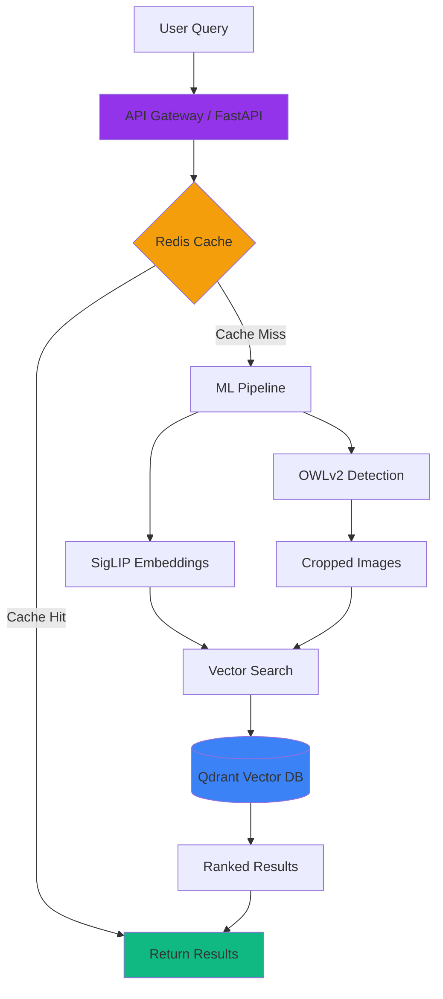

# System Architecture

## Components

- **FastAPI**: High-performance async API gateway
- **Redis**: Query result caching (1hr TTL)
- **OWLv2**: Zero-shot object detection
- **SigLIP**: Multimodal embeddings (1152-dim)
- **Qdrant**: Vector similarity search (Cosine)
