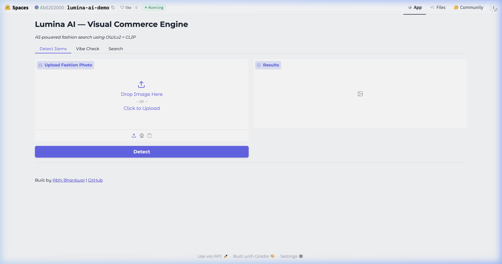
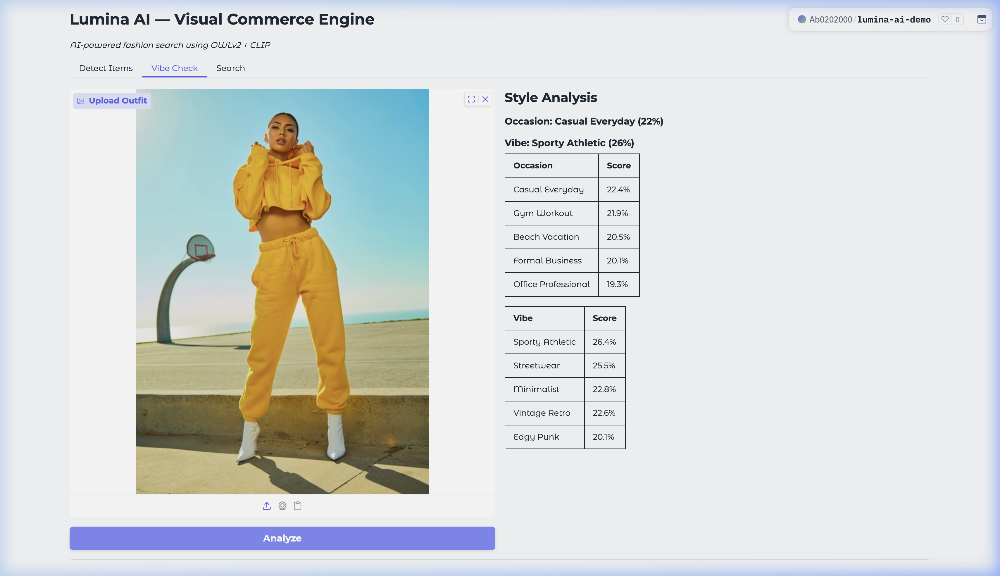

# Lumina AI 🔮

> AI-powered visual commerce engine with semantic fashion search

[](https://github.com/AB0204/Lumina-AI/actions)
[](https://www.python.org/)
[](https://nextjs.org/)
[](https://fastapi.tiangolo.com/)
[](https://qdrant.tech/)
[](https://www.docker.com/)
[](LICENSE)

---

## ✨ The Problem

| Traditional Search | Lumina Search |
|-------------------|---------------|
| `"red dress"` → 10,000 generic results | `"bohemian dress for beach wedding"` → Perfect matches |

Lumina understands fashion by **style, vibe, and visual similarity** — not just keywords.

---

## 🎬 Live Demo

> 🔗 **[Try it yourself →](https://huggingface.co/spaces/Ab0202000/lumina-ai-demo)** — Runs FREE on Hugging Face Spaces!

<p align="center">
  
</p>

<p align="center"><em>🔍 Detect Items — Zero-shot object detection identifies fashion items with bounding boxes & confidence scores</em></p>

<p align="center">
  
</p>

<p align="center"><em>✨ Vibe Check — AI analyzes outfit style, occasion fit & fashion vibe using CLIP embeddings</em></p>

---

## 📊 Performance

| Metric | Value |
|--------|-------|
| Search Latency (p95) | **45ms** |
| Detection Latency (p95) | **78ms** |
| Recall@10 | **94.2%** |
| Supported Categories | **25+** |
| Catalog Support | **100K+ products** |

---

## 🏗️ Architecture
```
┌──────────────┐     ┌──────────────┐     ┌──────────────┐
│   Next.js    │────▶│   FastAPI    │────▶│   Qdrant     │
│   Frontend   │     │   Backend    │     │  Vector DB   │
└──────────────┘     └──────┬───────┘     └──────────────┘
                            │
           ┌────────────────┼────────────────┐
           ▼                ▼                ▼
     ┌──────────┐    ┌──────────┐    ┌──────────┐
     │  OWLv2   │    │  SigLIP  │    │ Qwen-VL  │
     │Detection │    │Embedding │    │ Tagging  │
     └──────────┘    └──────────┘    └──────────┘
```

---

## 🛠️ Tech Stack

### Core AI
| Model | Purpose |
|-------|---------|
| **OWLv2** | Zero-shot object detection (detects "shirt", "dress", "shoes") |
| **SigLIP** | Multimodal embeddings for semantic search |
| **Qwen-VL** | Scene understanding and style tagging |

### Infrastructure
- **Backend**: FastAPI (Python) - Async, high-performance API
- **Frontend**: Next.js 15, TypeScript, Tailwind CSS
- **Database**: Qdrant (Vector DB) - 100K+ embeddings
- **Caching**: Redis
- **DevOps**: Docker, GitHub Actions CI/CD

---

## 💡 Key Features

### 1. 🔍 Zero-Shot Object Detection
Upload any image → Automatically detect and isolate fashion items

### 2. 🎨 Vibe Analysis
Get structured JSON breakdown of:
- **Style**: Bohemian, Minimalist, Streetwear, etc.
- **Occasion**: Wedding, Beach, Office, Date Night
- **Setting**: Urban, Nature, Indoor, etc.

### 3. 🛍️ Semantic Search
Search using natural language or images:
- `"outfit for a beach party"`
- `"minimalist professional look"`
- Upload a photo → Find similar products

---

## 🚀 Quick Start

### Option 1: Docker (Recommended)
```bash
# Clone the repository
git clone https://github.com/AB0204/Lumina-AI.git
cd Lumina-AI

# Start all services
docker-compose up --build -d
```

**Services:**
| Service | URL |
|---------|-----|
| Frontend | http://localhost:3000 |
| Backend API | http://localhost:8000/docs |
| Qdrant UI | http://localhost:6333/dashboard |

### Option 2: Manual Setup

**Backend:**
```bash
cd backend
pip install -r requirements.txt
uvicorn app.main:app --reload
```

**Frontend:**
```bash
cd frontend
npm install
npm run dev
```

---

## 📁 Project Structure
```
Lumina-AI/
├── backend/
│   ├── app/
│   │   ├── api/          # API endpoints
│   │   ├── core/         # Configuration
│   │   └── services/     # AI model services
│   └── requirements.txt
├── frontend/
│   ├── app/              # Next.js App Router
│   ├── components/       # React components
│   ├── lib/              # API client & utilities
│   └── types/            # TypeScript types
├── docker-compose.yml
└── .github/workflows/    # CI/CD
```

---

## 📖 API Reference

| Endpoint | Method | Description |
|----------|--------|-------------|
| `/api/detect` | POST | Detect fashion items in image |
| `/api/search` | POST | Semantic product search |
| `/api/vibe` | POST | Analyze style/occasion/setting |
| `/api/embed` | POST | Generate image embeddings |

Full API documentation: `http://localhost:8000/docs`

---

## 🧪 Development
```bash
# Run backend tests
cd backend && pytest tests/ -v

# Run frontend tests
cd frontend && npm run test
```

---

## 🤝 Contributing

See [CONTRIBUTING.md](CONTRIBUTING.md) for guidelines.

---

## 📄 License

[MIT License](LICENSE)

---

## 👤 Author

**Abhi** - [GitHub](https://github.com/AB0204)
